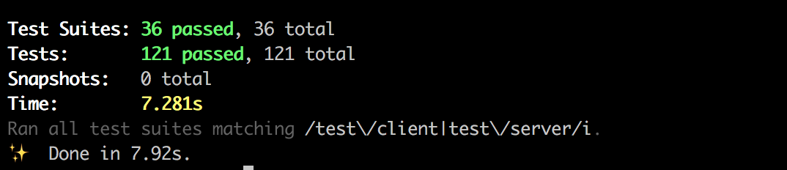

# Eventify
Do you want to eventify your life? To make it fuller and brighter? Find your ideal events here.  

A web app designed to see events happening in your city, big organised and local community events.
The web version of [event-app](https://github.com/emilyparkes/event-app).

>_For more information see the [wiki](https://github.com/emilyparkes/event-web/wiki)_


## Contents
- [Getting Started (Installation)](#getting-started)
  - [Testing](#testing)
- [Built With](#built-with)
- [Contributing](#contributing)
- [Credits](#credits)
- [License](#license)
- [Acknowledgements](#acknowledgements)


### Getting Started:
- create your own branch off of master
- pull down any changes
```shell
git pull origin dev
```
- install dependencies
```shell
yarn || npm
```
  - if `sodium` does not build run 
  ```shell
  sudo apt install automake autoconf libtool
  ```
- create your database
```shell
yarn migrate
yarn seed
```
- using auth
  - check the `.env.example` file
  - change it to `.env`
  - change the `JWT_SECRET`
- start the server
```shell
yarn dev
```

### Testing  
- Run the test command
```shell
yarn test
```
- Result: PASS for 36 test suites and 121 tests  
_(tests last run on October 1st '18)_  


## Built With 
- React
- Redux

## Contributing
Thank you for considering to contribute! I appreciate all notes and and work to help me improve my project.
See [contributing guidelines]() for more.

## Credits
[emily parkes](https://github.com/emilyparkes) - Initial work

## License 
Apache 2.0
See [Licence]() for details.

## Acknowledgements  
 - Enspiral Dev Academy for giving me the skills to code, and to continue to learn!


